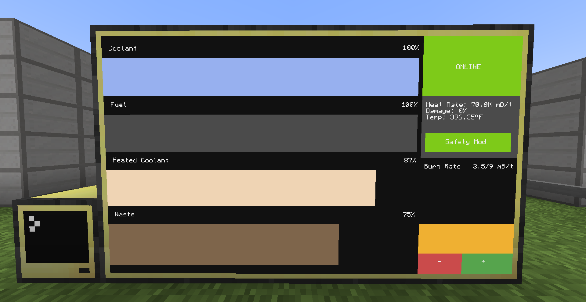

# ComputerCraft Fission Reactor Control System (Minecraft)

**A ComputerCraft app for fission reactor monitoring and control**

I made this so you don't blow up your reactor a million times like I did. Now you can monitor it easily and keep your base safe from explosions and radiation that could kill you!

This Lua UI runs on monitors or terminals to watch & control your reactor safely with real-time monitoring and automatic safety features.



## ✨ Key Features

- **Real-time monitoring**: Heat Rate, Damage %, Temperature (°F)
- **Resource level bars**: Coolant, Fuel, Heated Coolant, Waste
- **One-click reactor control**: Easy ONLINE/OFFLINE toggle button
- **Intelligent safety system**: Automatic shutdown with optional auto-restart
- **Configurable settings**: Adjust safety thresholds via `config.lua`

## 🎨 Status Color Guide

- **Lime Green** = Reactor is running normally
- **Red** = Manually turned off by user
- **Orange** = Automatically shut down by safety system (will auto-restart when safe)
- **Pink** = Emergency shutdown due to high danger (requires manual restart)

## ⚠️ Safety System

### Normal Safety Shutdown (Auto-restart enabled)

The system will automatically shut down and restart when these conditions are met:

- **Coolant** < 20%
- **Fuel** < 5%
- **Heated Coolant** > 99%
- **Waste** > 99%
- **Damage** > 20%

### High Danger Shutdown (Manual restart required)

Critical conditions that require your attention:

- **Temperature** > 5000°F
- **Damage** > 50%

> **Note**: Auto-restart only happens when ALL normal safety values return to safe ranges.
> You can change these thresholds in `config.lua`.

## 📁 File Structure

```
reactor.lua       # Main UI and control logic
functions.lua     # Reactor API adapter and peripheral interface
config.lua        # User-editable settings
```

## 🔧 Troubleshooting

| Problem                           | Solution                                                                          |
| --------------------------------- | --------------------------------------------------------------------------------- |
| **Reactor stuck in Pink state**   | Lower temperature or damage below thresholds, then press ONLINE                   |
| **Reactor stuck in Orange state** | Wait for all safety conditions to return to normal ranges, or disable Safety Mode |
| **Values showing 0 or n/a**       | Make sure reactor cables are connected and enabled                                |
| **No monitor detected**           | App automatically falls back to computer terminal                                 |
| **Safety system not working**     | Check that all sensor methods return valid numbers                                |

> **💡 Tip**: For best display experience, use a **5x3 monitor** setup (5 monitors wide, 3 monitors tall)

## 🎥 Demo Video

[](https://youtu.be/VIDEO_ID)

## 📜 Installation

### Quick Setup

1. **Download the installer**:

   ```lua
   wget https://ccfr.moma.dev install
   ```

2. **Run the installation**:

   ```lua
   install
   ```

3. **Restart your computer**:
   - Press `Ctrl+R` for 2-3 seconds or turn the computer off and on again
   - The reactor control system will start automatically


_Quick installation process demonstration_

### Requirements

- **ComputerCraft** computer
- **Monitor** (optional, 5x3 recommended for best display)
- **Fission reactor** with Logic Adapter connected to the computer
